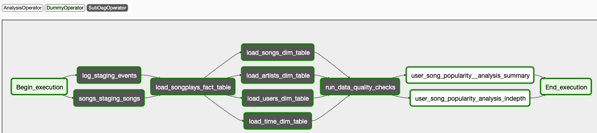
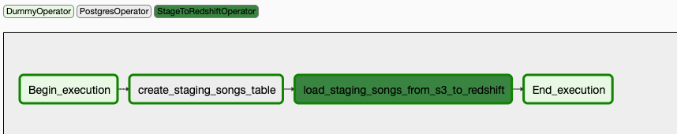
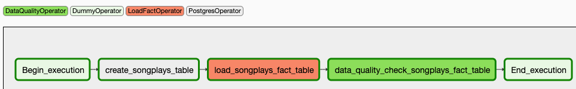
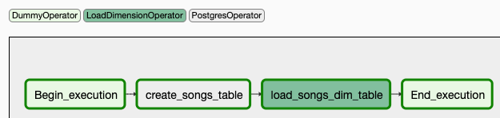
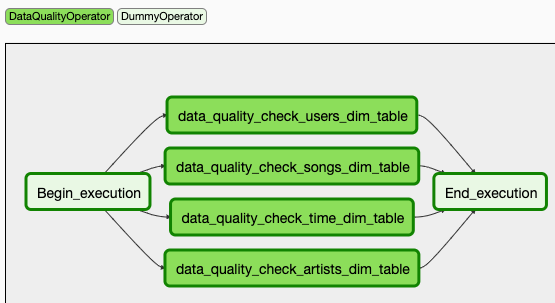
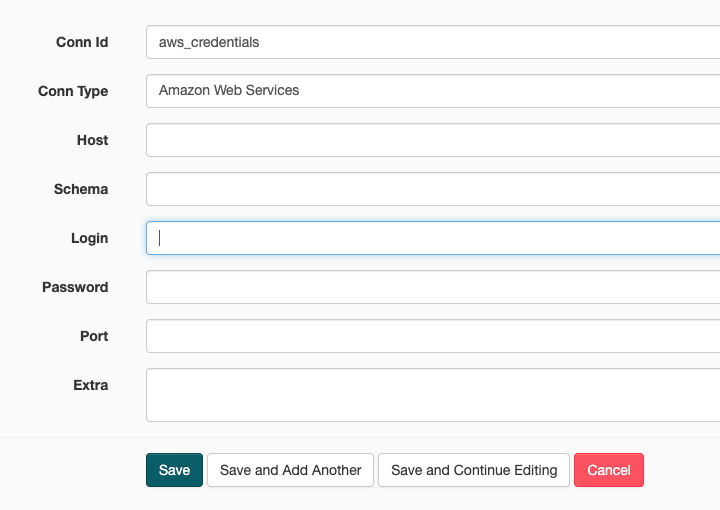
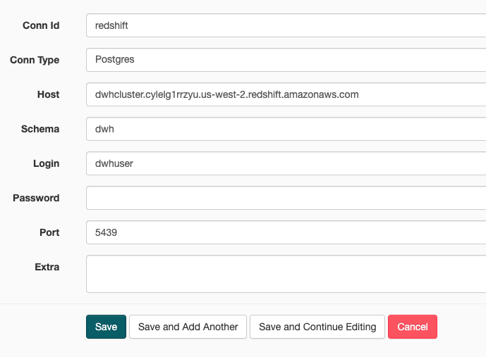

## Project: Data Pipelines with Airflow
**Project Description**: 
A music streaming company wants to introduce more automation and monitoring to their data warehouse ETL pipelines and they have come to the conclusion that the best tool to achieve this is **Apache Airflow**. As their Data Engineer, I was tasked to create a reusable production-grade data pipeline that incorporates data quality checks and allows for easy backfills. Several analysts and Data Scientists rely on the output generated by this pipeline and it is expected that the pipeline runs daily on a schedule by pulling new data from the source and store the results to the destination.

**Data Description**: The source data resides in S3 and needs to be processed in a data warehouse in Amazon Redshift. The source datasets consist of JSON logs that tell about user activity in the application and JSON metadata about the songs the users listen to.

**Data Pipeline design**:
At a high-level the pipeline does the following tasks.
1. Extract data from multiple S3 locations.
2. Load the data into Redshift cluster.
3. Transform the data into a star schema.
4. Perform data validation and data quality checks.
5. Runs a analysis in depth to find the count of distinct songs users listened to as a paid and a free user.
6. Runs a analysis summary to get the number of songs users listened to as a paid and a free user.


> Structure of the Airflow DAG


The DAG is the combination of several subdags,
* We have the generic staging subdag, which is used to create staging tables on Redshift and load data to it from S3 buckets. In this particular scenario it is used to create and load songs and logs data to staging tables on Redshift.



* The Load_fact table subdag, which is used to create a generic fact table on redshift using the staging tables and run data quality operations on it. For Sparkify, it can be used to create songplays fact table.



* Dimension subdag is used to create dimension tables on redshift. Sparkify uses it to create Users, Songs, Artists, and time dimension tables on Redshift, load it with necessary data.



* The data quality subdag, which can be used to run data quality checks on multiple tables. This is kept seperate for dimension tables, as all the **data quality checks can be run in parallel, saving time**, even combinig data across the tables. Sparkify uses it to run data quality tasks on its dimension tables.




**Design Goals**:
Based on the requirements of our data consumers, our pipeline is required to adhere to the following guidelines:
* The DAG should not have any dependencies on past runs.
* On failure, the task is retried for 3 times.
* Retries happen every 5 minutes.
* Catchup is turned off.
* Do not email on retry. 

**Pipeline Implementation**:

Apache Airflow is a Python framework for programmatically creating workflows in DAGs, e.g. ETL processes, generating reports, and retraining models on a daily basis. The Airflow UI automatically parses our DAG and creates a natural representation for the movement and transformation of data. A DAG simply is a collection of all the tasks you want to run, organized in a way that reflects their relationships and dependencies. A **DAG** describes *how* you want to carry out your workflow, and **Operators** determine *what* actually gets done. 

By default, airflow comes with some simple built-in operators like `PythonOperator`, `BashOperator`, `DummyOperator` etc., however, airflow lets you extend the features of a `BaseOperator` and create custom operators. For this project, I developed several custom operators. 

The description of each of these operators follows:
- **StageToRedshiftOperator**: Stages data to a specific redshift cluster from a specified S3 location. Operator uses templated fields to handle partitioned S3 locations.
- **LoadFactOperator**: Loads data to the given fact table by running the provided sql statement. Supports delete-insert and append style loads.
- **LoadDimensionOperator**: Loads data to the given dimension table by running the provided sql statement. Supports delete-insert and append style loads.
- **DataQualityOperator**: Used to verify that the given table has the required data by running tests agaisnt it.
- **AnalysisOperator**: Used to fullfill business demand analytical queries. 

 > Code for each of these operators is located in the **plugins/operators** directory.
 
Two or more operators can be grouped into one task using the SubDagOperator.
I have created several generic subdags, that can be reused later as well.


**Pipeline Schedule and Data Partitioning**: 
The events data residing on S3 is partitioned by *year* (2018) and *month* (11). Our task is to incrementally load the event json files, and run it through the entire pipeline to calculate song popularity and store the result back into S3. In this manner, we can obtain the top songs per day in an automated fashion using the pipeline. Please note, this is a trivial analyis, but you can imagine other complex queries that follow similar structure.

*S3 Input events data*:
```bash
s3://<bucket>/log_data/2018/11/
2018-11-01-events.json
2018-11-02-events.json
2018-11-03-events.json
..
2018-11-28-events.json
2018-11-29-events.json
2018-11-30-events.json
```

The DAG can be configured by giving it some default_args which specify the `retry_delay`, `retries` and other design choices which I have mentioned above.

```python
default_args = {
    'owner': 'aditya',
    'depends_on_past': False,
    'email_on_retry': False,
    'retries': 3,
    'retry_delay': timedelta(minutes=5),
    'catchup_by_default': False,
    'provide_context': True,
}
```

## How to run this project?
***Step 1: Create AWS Redshift Cluster using either the console or through the notebook provided,  `create_cluster.ipynb`***

Run the notebook to create AWS Redshift Cluster. Make a note of:
- DWN_ENDPOINT ::  dwhcluster.c4m4dhrmsdov.us-west-2.redshift.amazonaws.com
- DWH_ROLE_ARN ::  arn:aws:iam::506140549518:role/dwhRole

***Step 2: Start Apache Airflow***

Run `docker-compose up` from the directory containing `docker-compose.yml`. Ensure that you have mapped the volume to point to the location where you have your DAGs.

***Step 3: Configure Apache Airflow Connections***

Below is the `S3 connection`. The Login and password are the IAM user's access key and secret key that you created. Basically, by using these credentials, we are able to read data from S3.



Below is the `redshift connection`. These values can be easily gathered from your Redshift cluster



***Step 4: Execute the sparkify.star.schema dag***

I would suggest wait a minute after setting the Airflow connections, as it takes time for airflow to pick it up. 
After triggering the dag, sit back, relax, get a drink and wait for the analysis to complete, it usually takes around 10 minutes on 4 dc2.large redshift clusters.